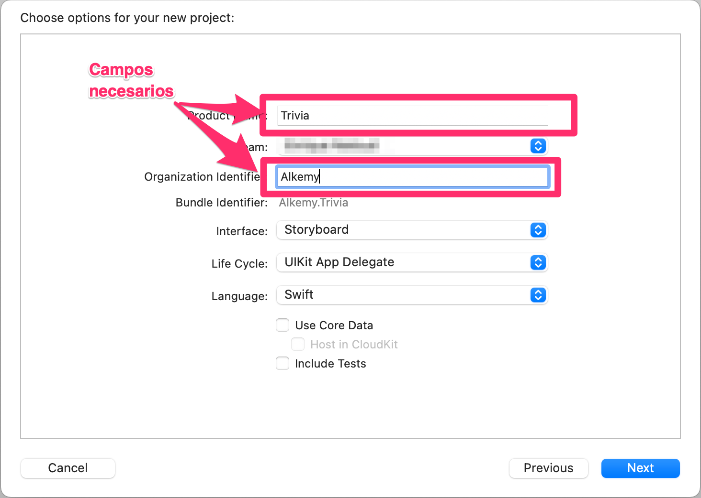
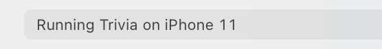
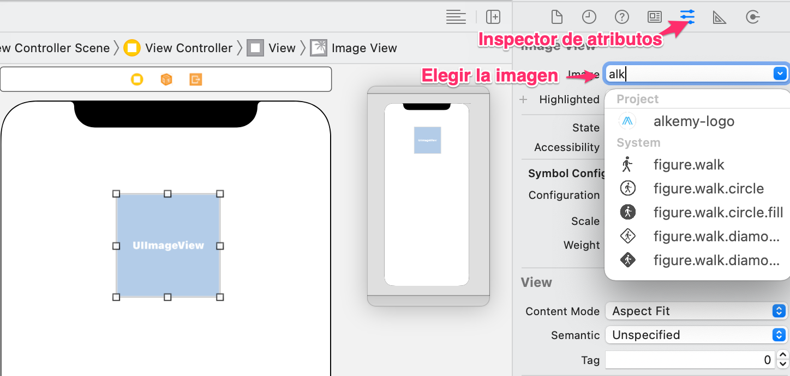

## ¿Qué es Xcode?
Xcode es la aplicación de Mac usada para crear aplicaciones iOS, macOS, tvOS y watchOS, es todo un entorno de desarrollo integrado, lo que esencialmente significa que Xcode incluye muchas herramientas adicionales para el desarrollo como depurador, control de código fuente, administración de dispositivos, iPhone Simulator, herramientas de creación de perfiles, Interface Builder, documentación y más. Está pensado principalmente para compilar Swift y Objective C, pero soporta otros lenguajes como C / C++, AppleScript, Java y más.

Xcode solo se ejecuta en macOS: necesita una Mac si desea crear aplicaciones de iOS con Xcode. Xcode no se ejecutará en iPad. Hay algunas alternativas disponibles para Windows / PC, pero están lejos de ser ideales.

Requisitos mínimos del sistema para Xcode 12:
* Una Mac con macOS Catalina ó macOS Big Sur 
* Al menos 50 GB de espacio de almacenamiento libre
* 8 GB de RAM pero 16 para más comodidad
* Al menos una CPU equivalente a Intel i5 o i7

## Descarga del Xcode
La forma más sencilla es mediante el siguiente link directo a la App Store:
[Descargar Xcode desde la App Store](https://apps.apple.com/us/app/xcode/id497799835?mt=12)

Tenga paciencia pues la instalación puede demorar dependiendo de la conexión.

También es posible instalar versiones anteriores del Xcode:

* Obtenga una cuenta de desarrollador gratuita con su ID de Apple [Más información acá](https://www.actualidadiphone.com/como-crear-una-cuenta-de-desarrollador-de-apple-para-usarla-en-xcode/)
* Vaya a https://developer.apple.com/download e inicie sesión
* Haga clic en "More" en la parte superior derecha de la página:

   
* Utilice el campo de búsqueda para encontrar versiones anteriores de Xcode

   
* Cuando haya encontrado Xcode 12.4, el ".dmg" para comenzar la instalación.

   

## Proyecto Trivia
A lo largo de este tutorial vamos a ir desarrollando una App de Trivia (preguntas y respuestas) basadas en una API pública llamada [Open Trivia](https://opentdb.com/).

## Primeros pasos en Xcode

### 1. Creando el Proyecto Trivia

Esta es la pantalla de bienvenida:

 

Las opciones son:
* Iniciar un proyecto de cero
* Clonar un proyecto existente en un repositorio de git
* Abrir un proyecto existente
* Abrir uno de los últimos proyectos usando el panel derecho

Elijamos la opción "Create a new Xcode project":

A continuación, cuando abre un proyecto de aplicación de iOS en Xcode, verá algo así:

 

Elija "iOS" (1) y luego "App" (2)

A continuación introduzca el nombre de la App, y el nombre de la organización:

 

Elija la ubicación de dónde crear el proyecto:

 

Finalmente aparecerá la pantalla principal del proyecto:

Tenemos 4 áreas principales en Xcode:

1. **Navegadores a la Izquierda**: ayudan a localizar recursos del proyecto tales como archivos Swift, errores de compilación, puntos de interrupción, buscadores, etc.

2. **Editor en el medio**: El editor, es acá donde el programador focaliza su atención la mayor parte del tiempo creando el código de su programa. Alternativamente cuando está diseñando la interfaz se ve también se puede ver el **Interface Builder**

3. **Inspectores a la derecha**: Permiten visualizar y cambiar atributos del elemento seleccionado en el editor, los inspectores son usados intensivamente en Interface Builder.

4. **Area de depuración en la parte inferior**: Permite inspeccionar las variables durante la ejecución del programa, y la consola permite interactuar con el programa en plena ejecución. Una parte importante de la depuración también está en el panel izquierdo y es la "Pila de llamadas":

    

**Otros elementos de la pantalla principal**:

* En la esquina superior derecha están los botones de Ejecutar y Detener el programa:

     

* Justo al lado hay dos menúes desplegables: Uno permite elegir el Target y el otro menú  permite elegir el dispositivo o simulador donde se ejecutará el programa:

     

    Target es el producto final, normalmente es una App, pero podría ser una librería, framework, unit test, etc. Mientras que el simulador o dispositivo permite elegir sobre qué dispositivo, ya sea virtual o físico se ejecutará la App. En la práctica normalmente target no se toca, mientras que el dispositivo se cambia continuamente para probar en distintos modelos de iPhone.

* En la parte superior, en el medio, hay una barra de estado donde Xcode indica lo que está haciendo, y los errores del proyecto.

    

* En la parte superior derecha, e izquierda hay botones que permiten mostrar u ocultar partes de Xcode. Si desea centrarse en algún código Swift, puede ocultar los paneles izquierdo y derecho, por ejemplo. 

    

* El botón + es la Biblioteca, que incluye fragmentos de código Swift (y más, en Interface Builder). 

* El botón con las dos flechas habilita el modo de revisión de código de Xcode, que le permite comparar archivos Swift uno al lado del otro.

    

### 2. Pantalla inicial de la App
En el paso anterior creamos la App.

Si oprimimos el botón "Ejecutar", la App se verá así:

Es hora de empezar a introducir contenido en nuestra App.

**Agregar una imagen al cátalogo de Imágenes: Assets.xcassets**

Cuando crea un nuevo proyecto, Xcode crea un catálogo llamado Assets.xcassets. 

Seleccione **Assets.xcassets** en el navegador de proyectos: 

y Xcode abrirá el catálogo en el área del editor.

El catálogo de activos contiene una lista de conjuntos de imágenes. Cada conjunto de imágenes, como AppIcon en la captura de pantalla, contiene todas las versiones de una imagen que son necesarias para admitir varios dispositivos y factores de escala. Puede agregar imágenes de iconos a su aplicación arrastrándolas a la celda correspondiente en la cuadrícula de conjunto de iconos.

Agregaremos el logo "alkemy-logo.png" a nuestro proyecto:

Para esto arrastraremos desde el "Finder" el logo:

Se verá así:

**Agregar a la App mediante el Interface Builder**

Como al crear el proyecto elegimos "Storyboards", Xcode creó un archivo: *Main.storyboard*:

Al elegir dicho archivo en el navegador del proyecto se abre el *Interface Builder*:

La **biblioteca de objetos** es un panel donde puede buscar elementos de la interfaz de usuario: Botones, Etiquetas, Campos de Texto, etc.

Para agregarlos al Storyboard deberá arrastrarlos y soltarlos en la vista.

Luego de haber ubicado el visor de la imagen podrá usar los "handlers" para modificar el tamaño de la imagen.

A la derecha está el "Inspector de Tamaño" que permite modificar el tamaño del elemento seleccionado.

En breve veremos un poco sobre como usar **"Layout Constraints"** para poder especificar el tamaño y ubicación de los elementos.

Para **elegir la imagen** deberemos oprimir el ícono de "Inspector de Atributos", y seleccionar la imagen que fue previamente importada a los Assets del proyecto.

**Auto Layout**

Auto Layout es un sistema para dimensionar y ubicar los elementos en la vista. Permite especificar las distancias relativas y absolutas entre los elementos y los márgenes de la vista. Dichas reglas son conocidas como "Constraints" (restricciones).

Por ejemplo, puede agregar una restricción que diga que un elemento debe estar 20 puntos por debajo del elemento que está encima. 

Con un mínimo de restricciones, el sistema de Auto Layout tiene la información necesaria para diseñar la interfaz de usuario. Sin embargo, con demasiadas restricciones podría suceder que halla restricciones en conflicto: Ejemplo por una regla se infiere que el ancho son 20 puntos, pero otra al mismo tiempo especifica 30 puntos. Cuando hay restricciones en conflicto Xcode avisará.

Para agregar restricciones, use los botones en la esquina inferior derecha del Interface Builder:

Acá hemos agregado tres restricciones: 
1. Ancho fijo de 132 puntos 
2. Alto fijo de 132 puntos 
3. Distancia al margen superior de 58 puntos

En vertical ya es posible ubicar al elemento: Tenemos su altura, y margen superior, sin embargo en horizontal tenemos el ancho, pero falta la ubicación horizontal. Vamos a agregar una restricción para que la imagen esté centrada horizontalmente respecto a la vista:

Arrastre desde la imágen hacia algún borde (izquierdo o derecho) con la tecla control presionada:

A continuación aparecerá el siguiente menú:

Ya fueron especificados todos los constraints, mínimos pero suficientes para ubicar el logo en el centro y la parte superior de la vista:

Estas restricciones funcionarán para un iPhone 7 o un iPad de 12.9 pulgadas.

Autolayout es un tema amplio, podemos encontrar más información acá:

https://www.efectoapple.com/introduccion-a-auto-layout-parte-i/

https://www.efectoapple.com/introduccion-a-auto-layout-parte-2/