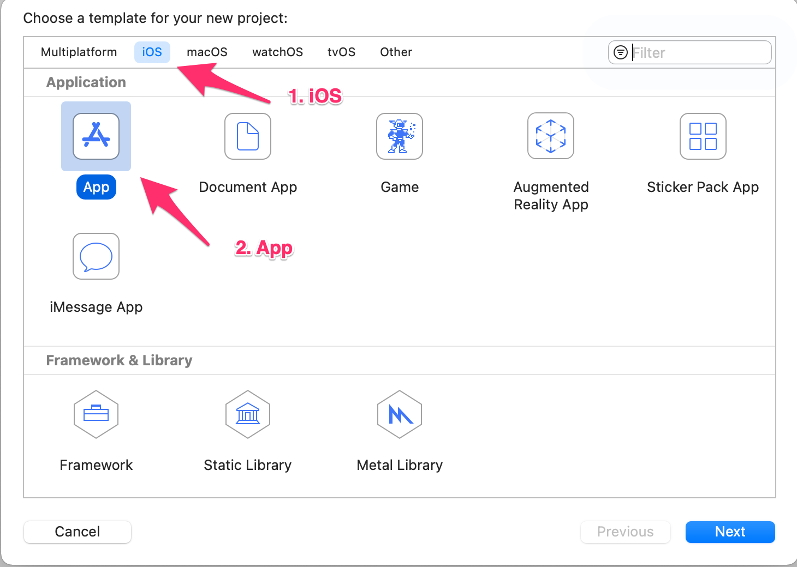
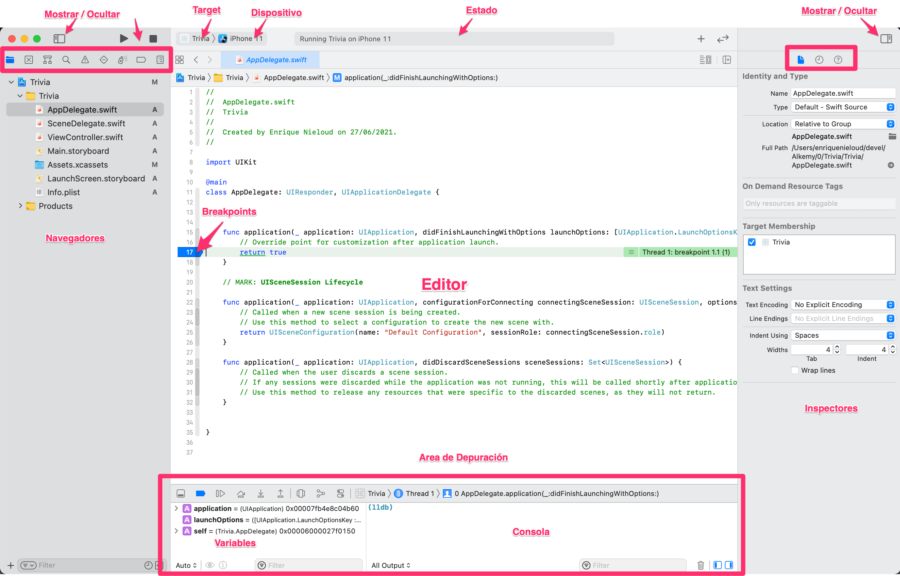

### ¿Qué es Xcode?
Xcode es la aplicación de Mac usada para crear aplicaciones iOS, macOS, tvOS y watchOS, es todo un entorno de desarrollo integrado, lo que esencialmente significa que Xcode incluye muchas herramientas adicionales para el desarrollo como depurador, control de código fuente, administración de dispositivos, iPhone Simulator, herramientas de creación de perfiles, Interface Builder, documentación y más. Está pensado principalmente para compilar Swift y Objective C, pero soporta otros lenguajes como C / C++, AppleScript, Java y más.

Xcode solo se ejecuta en macOS: necesita una Mac si desea crear aplicaciones de iOS con Xcode. Xcode no se ejecutará en iPad. Hay algunas alternativas disponibles para Windows / PC, pero están lejos de ser ideales.

Requisitos mínimos del sistema para Xcode 12:
* Una Mac con macOS Catalina ó macOS Big Sur 
* Al menos 50 GB de espacio de almacenamiento libre
* 8 GB de RAM pero 16 para más comodidad
* Al menos una CPU equivalente a Intel i5 o i7

### Descarga del Xcode
La forma más sencilla es mediante el siguiente link directo a la App Store:
[Descargar Xcode desde la App Store](https://apps.apple.com/us/app/xcode/id497799835?mt=12)

Tenga paciencia pues la instalación puede demorar dependiendo de la conexión.

También es posible instalar versiones anteriores del Xcode:

* Obtenga una cuenta de desarrollador gratuita con su ID de Apple [Más información acá](https://www.actualidadiphone.com/como-crear-una-cuenta-de-desarrollador-de-apple-para-usarla-en-xcode/)
* Vaya a https://developer.apple.com/download e inicie sesión
* Haga clic en "More" en la parte superior derecha de la página:

   
* Utilice el campo de búsqueda para encontrar versiones anteriores de Xcode

   
* Cuando haya encontrado Xcode 12.4, el ".dmg" para comenzar la instalación.

   

### Empezando con Xcode

Esta es la pantalla de bienvenida:

 

Las opciones son:
* Iniciar un proyecto de cero
* Clonar un proyecto existente en un repositorio de git
* Abrir un proyecto existente
* Abrir uno de los últimos proyectos usando el panel derecho

Elijamos la opción "Create a new Xcode project":

A continuación, cuando abre un proyecto de aplicación de iOS en Xcode, verá algo así:

 

Elija "iOS" (1) y luego "App" (2)

A continuación introduzca el nombre de la App, y el nombre de la organización:

 

Elija la ubicación de dónde crear el proyecto:

 

Finalmente aparecerá la pantalla principal del proyecto:

Tenemos 4 áreas principales en Xcode:

1. **Navegadores a la Izquierda**: ayudan a localizar recursos del proyecto tales como archivos Swift, errores de compilación, puntos de interrupción, buscadores, etc.

2. **Editor en el medio**: El editor, es acá donde el programador focaliza su atención la mayor parte del tiempo creando el código de su programa. Alternativamente cuando está diseñando la interfaz se ve también se puede ver el **Interface Builder**

3. **Inspectores a la derecha**: Permiten visualizar y cambiar atributos del elemento seleccionado en el editor, los inspectores son usados intensivamente en Interface Builder.

4. **Area de depuración en la parte inferior**: Permite inspeccionar las variables durante la ejecución del programa, y la consola permite interactuar con el programa en plena ejecución. Una parte importante de la depuración también está en el panel izquierdo y es la "Pila de llamadas":

    

**Otros elementos de la pantalla principal**:
* En la esquina superior derecha están los botones de Ejecutar y Detener el programa:

     

    Justo al lado hay dos menúes desplegables: Uno permite elegir el Target y el otro menú  permite elegir el dispositivo o simulador donde se ejecutará el programa:

     

    Target es el producto final, normalmente es una App, pero podría ser una librería, framework, unit test, etc. Mientras que el simulador o dispositivo permite elegir sobre qué dispositivo, ya sea virtual o físico se ejecutará la App. En la práctica normalmente target no se toca, mientras que el dispositivo se cambia continuamente para probar en distintos modelos de iPhone.

* En la parte superior, en el medio, hay una barra de estado donde Xcode indica lo que está haciendo, y los errores del proyecto.
* En la parte superior derecha, hay botones que permiten mostrar u ocultar partes de Xcode. Si desea centrarse en algún código Swift, puede ocultar los paneles izquierdo y derecho, por ejemplo. El botón + es la Biblioteca, que incluye fragmentos de código Swift (y más, en Interface Builder). El botón con las dos flechas habilita el modo de revisión de código de Xcode, que le permite comparar archivos Swift uno al lado del otro.
El editor de código en Xcode tiene dos funciones interesantes: una ruta de navegación y un minimapa. El minimapa es un esquema global de su código y funciona como una barra de desplazamiento. La ruta de navegación, o barra de salto, le ayuda a navegar por la jerarquía de su proyecto. También puede usarlo para saltar a una función o clase en particular. Y los botones <y> de la izquierda le permiten retroceder o avanzar a un archivo anterior, como en un navegador web.
A continuación, en este tutorial, veremos algunas partes de Xcode con más detalle ...